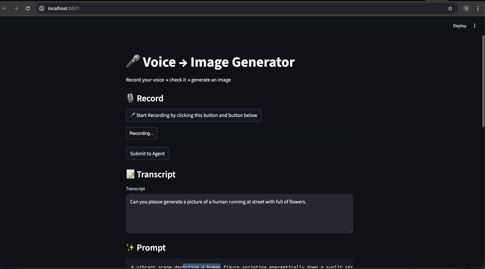
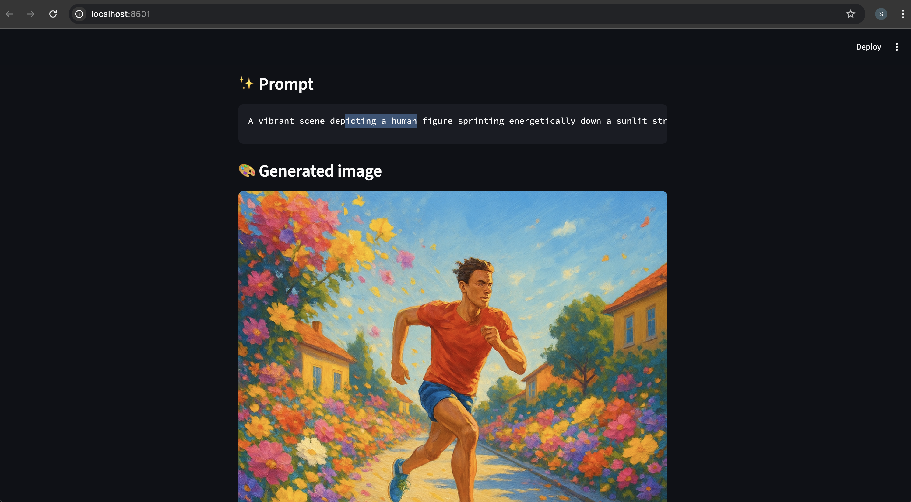

# 🎤 Voice → Image Generator

Turn your voice into pictures! Just speak what you want to see, and the app will create an image for you.

## What does it do?

1. **Record your voice** - Click the mic button and describe what you want to see
2. **AI listens** - The app transcribes what you said
3. **AI imagines** - Converts your description into a detailed image prompt
4. **AI draws** - Generates a beautiful image based on your words
5. **You see it** - The finished image appears on screen

## Screenshots

### Step 1: Record Your Voice


### Step 2: See Your Image


## Getting Started

### What you need

- Python 3.8 or higher
- An OpenAI API key (get one at https://platform.openai.com)
- FFmpeg (for audio)
  - **Mac**: `brew install ffmpeg`
  - **Linux**: `apt-get install ffmpeg`
  - **Windows**: Download from https://ffmpeg.org/download.html

### Setup (5 minutes)

1. **Get the code**
   ```bash
   git clone <repo-url>
   cd Masters_GenAI_Capstone2
   ```

2. **Create a virtual environment**
   ```bash
   python -m venv venv
   source venv/bin/activate  # On Windows: venv\Scripts\activate
   ```

3. **Install packages**
   ```bash
   pip install -r requirements.txt
   ```

4. **Add your OpenAI key**
   
   Create a `.env` file in the project folder and add:
   ```
   OPENAI_API_KEY=your_api_key_here
   ```
   
   **Important**: Don't share this file! It's already ignored by Git.

5. **Run it**
   ```bash
   streamlit run app.py
   ```
   
   Open your browser to `http://localhost:8501`

## How to use it

1. Click **"Start Recording"** and then click the **"Recording..."** button
2. Speak clearly - describe what image you want
3. Click **"Submit to Agent"** to process
4. See your transcript, the AI prompt, and the generated image!

### Tips for better images

- Use **descriptive words**: "a cozy cabin in snowy mountains at sunset" works better than "cabin"
- Be **specific**: Colors, mood, lighting, and style all help
- Try again if you don't like it - each attempt is unique!

## What's inside

```
Masters_GenAI_Capstone2/
├── app.py              # Main app (the one you run)
├── stt.py              # Listens & transcribes your voice
├── llm.py              # Turns words into image instructions
├── image_gen.py        # Creates the image
├── requirements.txt    # All the packages you need
├── .env                # Your secret API key (don't share!)
└── README.md           # This file
```

## Troubleshooting

**"No module named openai"**
- Run: `pip install -r requirements.txt`

**Microphone not working**
- Make sure your browser allows microphone access
- Refresh the page and try again

**"Invalid API key"**
- Check your `.env` file exists and has the right key
- Get a new key at https://platform.openai.com/account/api-keys

**FFmpeg error on Mac**
- Install it: `brew install ffmpeg`
- Or update the paths in `app.py` if it's in a different location


**Made for the Masters GenAI Capstone 2 Course**
